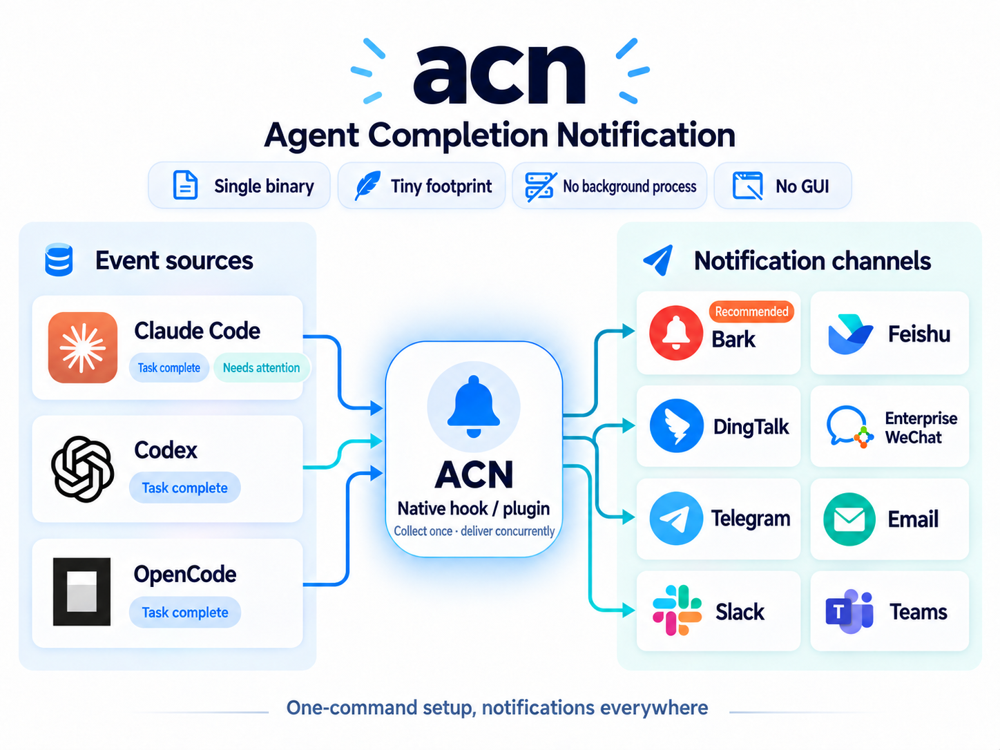

# acn (Agent Completion Notification)

[简体中文](README.md)

Send completion notifications from AI agents—Claude Code, Codex, and OpenCode—to Bark, Feishu, DingTalk, WeCom, Slack, Teams, Telegram, and email. acn integrates through native hooks and plugins: it is a tiny single binary with one-command setup, no background process, and no GUI.



## Quick start

### macOS

```bash
brew install windyskr/tap/acn
```

### Windows

```powershell
scoop bucket add windyskr https://github.com/Windyskr/scoop-bucket
scoop install windyskr/acn
```

### Linux

Download the `acn_<version>_linux_amd64.tar.gz` archive for your architecture (or `linux_arm64`) from [GitHub Releases](https://github.com/Windyskr/agent-completion-notification/releases), extract it, then place `acn` on your `PATH`:

```bash
curl -sL https://github.com/Windyskr/agent-completion-notification/releases/latest/download/acn_$(curl -s https://api.github.com/repos/Windyskr/agent-completion-notification/releases/latest | grep -o '"tag_name": *"[^"]*"' | cut -d'"' -f4 | tr -d v)_linux_amd64.tar.gz | tar -xz
sudo install -m 0755 acn /usr/local/bin/acn
```

<details>
<summary>Other installation methods</summary>

The repository includes a PowerShell installer. It selects the x64 or ARM64 build, verifies SHA-256, installs it into your user directory, and adds it to your user `PATH`:

```powershell
$installer = Join-Path $env:TEMP 'install-acn.ps1'
Invoke-WebRequest https://raw.githubusercontent.com/Windyskr/agent-completion-notification/main/install.ps1 -OutFile $installer
& $installer
```

You can also download the appropriate Windows ZIP from [GitHub Releases](https://github.com/Windyskr/agent-completion-notification/releases), extract it, and add its directory to `PATH`.

For developers who already have Go installed:

```powershell
go install github.com/windyskr/agent-completion-notification/cmd/acn@latest
```
</details>

Configure at least one notification channel, install the integrations, then run a delivery check:

```shell
# Bark is recommended: install the Bark app from the iOS App Store to obtain a push URL.
acn config bark-url https://api.day.app/your_key
acn config feishu-url https://open.feishu.cn/open-apis/bot/v2/hook/your_key
acn config dingtalk-url https://oapi.dingtalk.com/robot/send?access_token=your_key
acn config wecom-url https://qyapi.weixin.qq.com/cgi-bin/webhook/send?key=your_key
acn config slack-url https://hooks.slack.com/services/your/webhook
acn config teams-url https://your-teams-webhook-url

# Install hooks for Claude Code, Codex, and OpenCode.
acn install

# Check the complete delivery path and send a test notification.
acn doctor
```

Restart the relevant AI CLI after installation.

## Commands

```text
acn install [claude|codex|opencode]   Install an AI CLI integration; installs all when omitted
acn uninstall [claude|codex|opencode] Remove an integration
acn status                            Show integration and configuration status
acn doctor                            Check the complete path and send a real test notification
acn update [--check]                  Update to the latest stable release; --check only checks
acn config <k> <v>                    Change a configuration value
```

### `acn doctor`

Run it once after setup. It validates the configuration and sends an actual notification:

```text
✓ Binary           /opt/homebrew/bin/acn
✓ Claude Code      hook installed → /opt/homebrew/bin/acn
✓ Codex            hook installed → /opt/homebrew/bin/acn
✓ Codex trust      current ACN hook trusted
✓ OpenCode         hook installed → /opt/homebrew/bin/acn
✓ Feishu webhook   https://open.feishu.cn/…/xxxx…xxxx
? Bark endpoint    not configured (optional)
✓ Delivery         sent; confirm receipt in a configured channel
```

## Configuration

Configuration is stored in `~/.acn/config.json` with mode `0600`; changes take effect immediately.

```text
acn config bark-url <url|off>                 Configure and enable Bark; off only disables this channel
acn config bark-update-by-session <on|off>    Update the same Bark notification per session; default: on
acn config feishu-url <url|off>               Configure and enable Feishu
acn config feishu-secret <str|off>            Feishu signing secret; off clears it
acn config bark-codex-open-url <url|default|off>   Codex tap URL; default: chatgpt://codex
acn config bark-claude-open-url <url|default|off>  Claude tap URL; default: claude://
acn config dingtalk-url <url|off>             Configure and enable DingTalk
acn config dingtalk-secret <str|off>          DingTalk signing secret; off clears it
acn config wecom-url <url|off>                Configure and enable WeCom
acn config telegram-token <token|off>         Configure and enable Telegram
acn config telegram-chat-id <id>              Telegram user, group, or channel ID
acn config email-smtp <host:port|off>          SMTP address; off only disables email
acn config email-username <str>               SMTP user name
acn config email-password <str>               SMTP password or app password
acn config email-from <address>               Sender address
acn config email-to <addresses>               Recipient addresses, separated by commas
acn config slack-url <url|off>                Configure and enable a Slack Incoming Webhook
acn config teams-url <url|off>                Configure and enable a Teams Incoming Webhook

acn config feishu|bark|dingtalk|wecom <on|off> Enable or disable the respective channel
acn config telegram|email|slack|teams <on|off> Enable or disable the respective channel
acn config min-duration <seconds>              Suppress notifications below this duration; 0 means unlimited
acn config max-message-length <characters>     Maximum notification body length; default: 1000, 0 means unlimited
acn config notification-timezone <timezone|local> IANA timezone for notification timestamps; default: local machine timezone
acn config ignore-dir <path|off>               Ignore a directory and its descendants; off clears every rule
acn config unignore-dir <path>                 Remove one ignore rule
acn config ignore-list                         List ignored directories
acn config device-name <name|default>          Set and display device name; default: system hostname
acn config show-device-name <on|off>           Show device name; default: off
acn config show-agent-name <on|off>            Show agent name; default: off
acn config show-project-name <on|off>          Show project name; default: off
acn config claude-agent-name <name|default>    Claude agent name; default: claude
acn config codex-agent-name <name|default>     Codex agent name; default: Codex
acn config opencode-agent-name <name|default>  OpenCode agent name; default: OpenCode

acn config claude|codex|opencode <on|off>      Enable or disable notifications from the respective agent
acn config claude-attention <on|off>           Notify when Claude requires input or permission; default: on
acn config claude-idle-reminder <on|off>       Notify after 60 seconds without input at Claude turn end; default: off
```

For example, if the computer uses Japan time but notifications should show Shanghai time:

```text
acn config notification-timezone Asia/Shanghai
```

Use `acn config notification-timezone local` to restore the machine's local timezone. This only affects the completion timestamp in the notification body; it does not affect duration measurement or webhook-signature timestamps.

Notification titles use the session name by default. Claude Code reads the `ai-title` record from its transcript. Codex looks up the hook `session_id` in `$CODEX_HOME/session_index.jsonl` (by default, `~/.codex/session_index.jsonl`). On `session.idle`, the OpenCode plugin reads the session title and latest assistant message. When a session name is unavailable, acn uses the enabled device, agent, and project-name prefixes; when all prefixes are disabled, it shows `Task complete` to avoid an empty title.

Device, agent, and project names are disabled in titles by default, while existing settings remain valid. When explicitly enabled, they become session-name prefixes, for example `MacBookPro-Codex-acn-Improve component ablation plan`. Each agent name can be configured independently. Pass `default` to restore its default name; setting an agent name automatically enables agent-name display.

Use the endpoint copied from the Bark app, truncated at the device key, such as `https://api.day.app/your_key`; do not append a title or markdown. Bark notifications are grouped under `agent-completion-notification` and use the built-in [Codex](assets/icons/codex.png) or [Claude](assets/icons/claude.png) icon (iOS 15 or later is required for icons). Tapping a Codex notification opens `chatgpt://codex`; tapping a Claude notification opens `claude://`. Both URLs accept a custom address, `default`, or `off` independently. By default, the event session ID is sent as Bark's string `id`, so later notifications for the same session update the existing notification while other sessions remain separate. Disable this through `bark-update-by-session off`. This feature requires Bark v1.5.2 or bark-server v2.2.5 or later.

The OpenCode integration is `~/.config/opencode/plugins/acn.js` (the same user-directory location on Windows). `acn install opencode` updates the file idempotently. `acn uninstall opencode` deletes only the plugin generated by acn. Restart OpenCode after either action.

### Claude Code attention notifications

In addition to Stop events, acn sends notifications when Claude Code needs you during a turn. An `AskUserQuestion` notification includes the question and every option; a tool-permission notification includes the approval prompt. Both are enabled by default and can be disabled with `acn config claude-attention off`. The idle reminder, sent after 60 seconds without input at the end of a turn, substantially overlaps with completion notifications and is disabled by default; enable it with `acn config claude-idle-reminder on`. These hooks run asynchronously and do not block the conversation. `ignore-dir` rules also apply to attention notifications. Codex and OpenCode do not expose an equivalent mechanism.

Enabled and configured channels send concurrently. A failure in one channel does not stop delivery attempts to the others, and errors identify the failed channel. Notification replies retain at most 1,000 characters by default; change this with `max-message-length`, or use `0` for no truncation.

`ignore-dir` suppresses completion notifications for a directory and all of its descendants. Rules are stored as absolute paths and match the directory itself and child directories without matching unrelated paths with the same prefix. Use `unignore-dir` to remove one rule, `ignore-list` to view all rules, and `ignore-dir off` to clear them. Suppression happens before delivery, so every configured channel is skipped and the hook reports the reason on stderr.

DingTalk uses a custom bot webhook; configure `dingtalk-secret` when the bot has signing enabled. WeCom uses a group-bot webhook. For Telegram, create a bot with BotFather, then configure the bot token and target `chat_id`; the bot must belong to the target group or channel and have permission to post. Slack uses a Slack App Incoming Webhook URL. Teams uses an Incoming Webhook URL created in a channel or chat and receives MessageCard-compatible Markdown. Email uses standard SMTP: port 465 automatically uses implicit TLS, while other ports require STARTTLS. Use an app-specific password or authorization code from the email provider rather than your primary account password.

Setting `device-name` automatically enables device-name display; setting a channel URL automatically enables that channel. To override these automatic behaviors, explicitly run `show-device-name off` or `<channel> off`.

The following environment variables take precedence over the configuration file: `ACN_FEISHU_WEBHOOK_URL`, `ACN_FEISHU_SECRET`, `ACN_BARK_URL`, `ACN_DINGTALK_WEBHOOK_URL`, `ACN_DINGTALK_SECRET`, `ACN_WECOM_WEBHOOK_URL`, `ACN_TELEGRAM_BOT_TOKEN`, `ACN_TELEGRAM_CHAT_ID`, `ACN_EMAIL_SMTP`, `ACN_EMAIL_USERNAME`, `ACN_EMAIL_PASSWORD`, `ACN_EMAIL_FROM`, `ACN_EMAIL_TO`, `ACN_SLACK_WEBHOOK_URL`, `ACN_TEAMS_WEBHOOK_URL`, and `ACN_DEVICE_NAME`. `ACN_CONFIG_DIR` changes the configuration directory.

## Development

```bash
make test     # go vet + go test -race
make build    # writes ./bin/acn
```

For a local Windows build:

```powershell
go build -ldflags '-s -w' -o .\bin\acn.exe .\cmd\acn
```

## License

MIT

## Star History

<a href="https://www.star-history.com/?repos=Windyskr%2Fagent-completion-notification&type=date&legend=bottom-right">
 <picture>
   <source media="(prefers-color-scheme: dark)" srcset="https://api.star-history.com/chart?repos=Windyskr/agent-completion-notification&type=date&theme=dark&legend=top-left&sealed_token=ULB4aO5tq_K1QT7ByThTkai00Cj7goziTFRdqkVGRidzDf2Osb9OoTSrnlRJVjcn-S0vbJukUX5C18EUcn8xLfUO95ZJYpjvOYM7iUDvAsJjLmf-_Fx-CbYXzGq_IqljJZGCIJUTqlteFHIXx4IJmiZAErK8--dapn0rVXX8AGw7Lz9BrLewk0jLSs8I" />
   <source media="(prefers-color-scheme: light)" srcset="https://api.star-history.com/chart?repos=Windyskr/agent-completion-notification&type=date&legend=top-left&sealed_token=ULB4aO5tq_K1QT7ByThTkai00Cj7goziTFRdqkVGRidzDf2Osb9OoTSrnlRJVjcn-S0vbJukUX5C18EUcn8xLfUO95ZJYpjvOYM7iUDvAsJjLmf-_Fx-CbYXzGq_IqljJZGCIJUTqlteFHIXx4IJmiZAErK8--dapn0rVXX8AGw7Lz9BrLewk0jLSs8I" />
   
 </picture>
</a>
