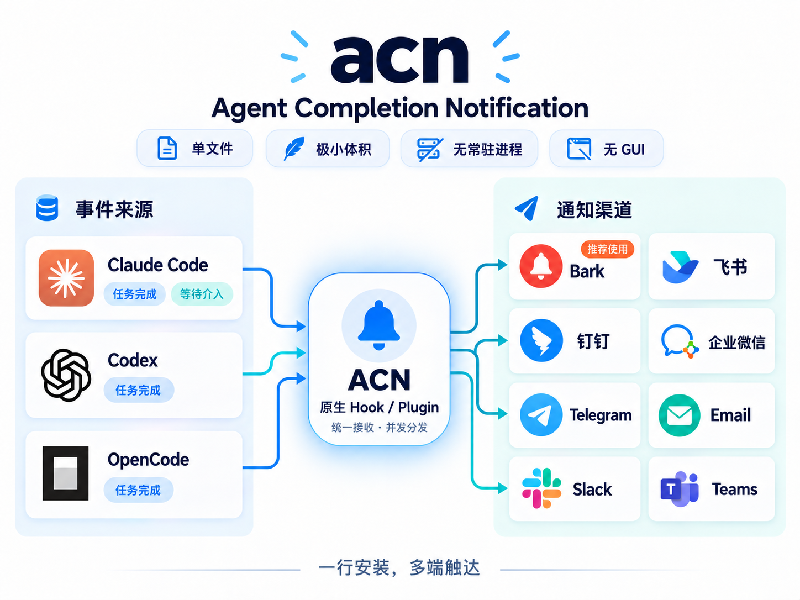

# acn（Agent Completion Notification）

推送 Agent (Claude code、Codex）完成通知到 Bark、飞书、钉钉、企微、TG等。
原生 Stop hook 接入，单文件极小体积，一行命令即可安装，无常驻进程，无 GUI。




## 快速接入

### macOS

```bash
brew install windyskr/tap/acn
```

### Windows

```powershell
scoop bucket add windyskr https://github.com/Windyskr/scoop-bucket
scoop install windyskr/acn
```
<details collapsed>
<summary>其他安装方法</summary>

使用仓库提供的 PowerShell 安装脚本。脚本会自动选择 x64/ARM64 版本、校验
SHA-256、安装到用户目录并加入用户 `PATH`：

```powershell
$installer = Join-Path $env:TEMP 'install-acn.ps1'
Invoke-WebRequest https://raw.githubusercontent.com/Windyskr/agent-completion-notification/main/install.ps1 -OutFile $installer
& $installer
```

不想使用包管理器时，也可以从
[GitHub Releases](https://github.com/Windyskr/agent-completion-notification/releases)
下载对应的 Windows ZIP，解压后把目录加入 `PATH`。

`go install` 作为已有 Go 工具链的开发者安装方式：

```powershell
go install github.com/windyskr/agent-completion-notification/cmd/acn@latest
```
</details>


```shell
# 配置通知渠道
# 配置至少一个通知渠道，配置多个同步推送
acn config bark-url https://api.day.app/your_key
acn config feishu-url https://open.feishu.cn/open-apis/bot/v2/hook/your_key
acn config dingtalk-url https://oapi.dingtalk.com/robot/send?access_token=your_key
acn config wecom-url https://qyapi.weixin.qq.com/cgi-bin/webhook/send?key=your_key
# 安装 hooks 到 Claude Code 和 Codex
acn install
# 自检
acn doctor                          
# 重启后生效
```

## 命令

```
acn install [claude|codex]     接入 AI CLI，省略目标则两个都装
acn uninstall [claude|codex]   移除接入
acn status                     查看接入状态与配置
acn doctor                     自检整条链路，并实际推送一条通知
acn update [--check]           更新到最新正式版；--check 仅检查
acn config <k> <v>             修改配置
```

### acn doctor

装好之后跑一次，它会主动核对配置：

```
✓ 二进制         /opt/homebrew/bin/acn
✓ Claude Code    hook 已安装 → /opt/homebrew/bin/acn
✓ Codex          hook 已安装 → /opt/homebrew/bin/acn
✓ Codex 信任     已信任当前 ACN hook
✓ 飞书 webhook   https://open.feishu.cn/…/xxxx…xxxx
? Bark endpoint  未配置（可选）
✓ 实际推送       已发出，请确认已配置渠道是否收到
```

## 配置

配置在 `~/.acn/config.json`（权限 0600），改完即时生效。

```
acn config feishu-url <url|off> 配置并启用飞书，off 仅关闭渠道
acn config feishu-secret <str|off> 签名密钥，off 清除配置
acn config bark-url <url|off>   配置并启用 Bark，off 仅关闭渠道
acn config bark-update-by-session <on|off> 同会话更新同一条 Bark 通知，默认 on
acn config bark-codex-open-url <url|default|off> Codex 点击地址，默认 chatgpt://codex
acn config bark-claude-open-url <url|default|off> Claude 点击地址，默认 claude://
acn config dingtalk-url <url|off> 配置并启用钉钉，off 仅关闭渠道
acn config dingtalk-secret <str|off> 钉钉加签密钥，off 清除配置
acn config wecom-url <url|off>  配置并启用企微，off 仅关闭渠道
acn config telegram-token <token|off> 配置并启用 Telegram，off 仅关闭渠道
acn config telegram-chat-id <id> Telegram 用户、群组或频道 ID
acn config email-smtp <host:port|off> SMTP 地址，off 仅关闭渠道
acn config email-username <str> SMTP 用户名
acn config email-password <str> SMTP 密码或授权码
acn config email-from <address> 发件人地址
acn config email-to <addresses> 收件人地址，多个用逗号分隔


acn config feishu <on|off>      是否启用飞书渠道
acn config bark <on|off>        是否启用 Bark 渠道
acn config dingtalk <on|off>    是否启用钉钉渠道
acn config wecom <on|off>       是否启用企微渠道
acn config telegram <on|off>    是否启用 Telegram 渠道
acn config email <on|off>       是否启用 Email 渠道
acn config min-duration <秒>    低于该耗时不推送，0 为不限
acn config max-message-length <字符数> 通知正文最大长度，默认 1000，0 为不限
acn config device-name <名称|default>  设置并显示设备名（默认使用系统 hostname）
acn config show-device-name <on|off>   是否显示设备名，默认 off
acn config show-agent-name <on|off>    是否显示 Agent 名，默认 off
acn config show-project-name <on|off>  是否显示项目名，默认 off
acn config claude-agent-name <名称|default>  Claude Agent 名，默认 claude
acn config codex-agent-name <名称|default>   Codex Agent 名，默认 Codex


acn config claude <on|off>      是否推送 Claude Code
acn config codex <on|off>       是否推送 Codex
```

通知标题默认直接使用会话名，例如 `完善组件消融实验方案`。Claude Code 从 transcript
中的 `ai-title` 记录读取；Codex 用 hook 的 `session_id` 查询
`$CODEX_HOME/session_index.jsonl`（默认 `~/.codex/session_index.jsonl`）。取不到会话名时
使用已开启的设备、Agent、项目名前缀；所有前缀均关闭时显示 `任务完成`，避免旧版本
或临时会话产生空标题。

设备名、Agent 名和项目名默认均不参与标题，但原有配置仍然保留。显式开启后会作为
会话名前缀，例如 `MacBookPro-Codex-acn-完善组件消融实验方案`。两个 Agent 名均可
独立配置，传入 `default` 可恢复各自的默认名称；设置 Agent 名会自动打开 Agent 名显示。

Bark URL 使用 App 复制出的设备端点并截到 key，例如 `https://api.day.app/your_key`；
不要在其后附加 title 或 markdown。Bark 通知默认发送到 `agent-completion-notification`
分组，并根据来源使用仓库内置的 [Codex](assets/icons/codex.png) 或
[Claude](assets/icons/claude.png) 官方图标（图标需要 iOS 15 及以上）。点击 Codex
通知会通过 `chatgpt://codex` 打开 Codex，点击 Claude 通知会通过 `claude://`
打开 Claude。两个来源均可传入自定义地址、`default` 恢复默认值或 `off` 单独关闭。
默认使用事件的会话 ID 作为 Bark 字符串 `id`，同一会话的后续完成通知会更新原通知，
不同会话分别保留；可通过 `bark-update-by-session off` 关闭。此功能需要 Bark
v1.5.2、bark-server v2.2.5 或更高版本。
已配置且启用的
渠道会并发发送，一个渠道失败不会阻止另一个渠道尝试，错误信息会注明失败渠道。
通知中的回复原文默认最多保留 1000 个字符，可通过 `max-message-length` 修改；
设置为 `0` 时不截断。

钉钉使用自定义机器人 webhook；若机器人开启了「加签」安全设置，再配置
`dingtalk-secret`。企微使用群机器人 webhook。Telegram 需要先通过 BotFather 创建
Bot，再配置 bot token 和目标 `chat_id`；Bot 必须已加入目标群组或频道并具备发消息权限。
Email 使用标准 SMTP：465 端口自动使用隐式 TLS，其他端口要求服务器支持 STARTTLS。
建议使用邮箱服务商生成的应用专用密码或授权码，不要使用主账号密码。

设置 `device-name` 会自动打开设备名显示；设置渠道 URL 会自动打开对应渠道。需要覆盖
自动行为时，再显式执行 `show-device-name off` 或对应渠道的 `<channel> off`。

环境变量 `ACN_FEISHU_WEBHOOK_URL`、`ACN_FEISHU_SECRET`、`ACN_BARK_URL`、
`ACN_DINGTALK_WEBHOOK_URL`、`ACN_DINGTALK_SECRET`、`ACN_WECOM_WEBHOOK_URL`、
`ACN_TELEGRAM_BOT_TOKEN`、`ACN_TELEGRAM_CHAT_ID`、`ACN_EMAIL_SMTP`、
`ACN_EMAIL_USERNAME`、`ACN_EMAIL_PASSWORD`、`ACN_EMAIL_FROM`、`ACN_EMAIL_TO`、
`ACN_DEVICE_NAME`
优先级高于配置文件。
`ACN_CONFIG_DIR` 可改配置目录。


## 开发

```bash
make test     # go vet + go test -race
make build    # 产出 ./bin/acn
```

Windows 本机构建使用：

```powershell
go build -ldflags '-s -w' -o .\bin\acn.exe .\cmd\acn
```

## 许可

MIT

## Star History

<a href="https://www.star-history.com/?repos=Windyskr%2Fagent-completion-notification&type=date&legend=bottom-right">
 <picture>
   <source media="(prefers-color-scheme: dark)" srcset="https://api.star-history.com/chart?repos=Windyskr/agent-completion-notification&type=date&theme=dark&legend=top-left&sealed_token=ULB4aO5tq_K1QT7ByThTkai00Cj7goziTFRdqkVGRidzDf2Osb9OoTSrnlRJVjcn-S0vbJukUX5C18EUcn8xLfUO95ZJYpjvOYM7iUDvAsJjLmf-_Fx-CbYXzGq_IqljJZGCIJUTqlteFHIXx4IJmiZAErK8--dapn0rVXX8AGw7Lz9BrLewk0jLSs8I" />
   <source media="(prefers-color-scheme: light)" srcset="https://api.star-history.com/chart?repos=Windyskr/agent-completion-notification&type=date&legend=top-left&sealed_token=ULB4aO5tq_K1QT7ByThTkai00Cj7goziTFRdqkVGRidzDf2Osb9OoTSrnlRJVjcn-S0vbJukUX5C18EUcn8xLfUO95ZJYpjvOYM7iUDvAsJjLmf-_Fx-CbYXzGq_IqljJZGCIJUTqlteFHIXx4IJmiZAErK8--dapn0rVXX8AGw7Lz9BrLewk0jLSs8I" />
   
 </picture>
</a>
